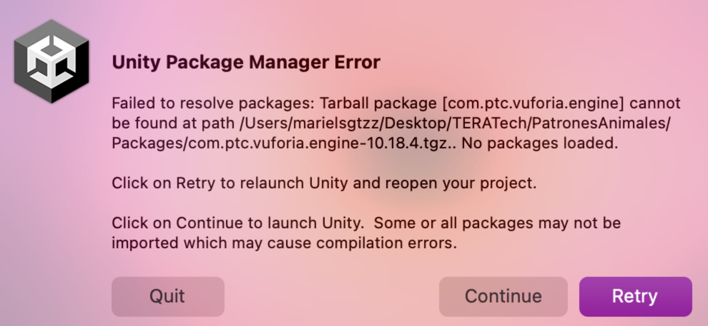
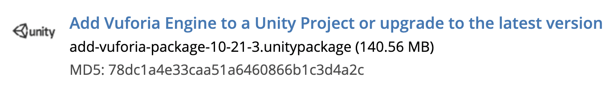

# CONTRIBUIR AL REPO

## Documentación

Cuando realices un proceso que consideres puede ser repetitivo o que sea necesario que varias personas lo hagan, asegúrate de documentarlo en este archivo.

Si quieres agregar imágenes a este `.md` o al `README.md` agrega las imágenes a la carpeta `imgs` y no vayas a cambiar el nombre de las imágenes que ya están ahí porque seguramente en algún archivo ya se hizo referencia a esas imágenes.

Cada experiencia debe tener su documentación específica. Dentro de la carpeta del proyecto hay que elaborar un `README.md` específico para la experiencia en cuestión. Los que sean aprendizajes más generales que puedan ser útiles para otras experiencias deberían de estar documentados en este archivo.

## Pruebas

Para probar en Unity las experiencias de AR que usan como target el suelo, se usa el target de [`GroundPlaneTarge`](Targets/GroundPlaneTarget.pdf).

## Clonar el repositorio

Después de clonar el repositorio, cuando se abre un proyecto es importante ir a `Build Settings` y cambiar a iOS y luego a la carpeta de `Scenes` en los `Assets` y cargar alguna porque como es la primera vez que se abre el repo se precarga la escena por default.

## Reacomodo de archivos y folders

En los proyectos de Vuforia es necesario que las carpetas de `Editor`, `XR`, `TextMesh-Pro` y `Resources` estén en la raíz del proyecto (sección de `Assets`)

## Errores comunes

### Al hacer push a Azure

Si al intentar realizar un _push_ y aparecen estos errores
`error: RPC failed; HTTP 413 curl 22 The requested URL returned error: 413` quiere decir que lo que se está intentando empujar al `remote` es demasiado grande/pesado. Primero se recomienda disminuir la cantidad de `commits` a los que se les quiere hacer push. Si aún no se logra el `push` es recomendable copiar los cambios (hacer una copia de la carpeta del repo) y volver a clonar el repo pero [SSH](https://learn.microsoft.com/en-us/azure/devops/repos/git/use-ssh-keys-to-authenticate?view=azure-devops) y pegar los cambios e intentar hacer push de pocos commits a la vez.

### Problema en Paquete de Vuforia

A veces al querer abrir el proyecto aparece una advertencia de que no se encuentra el paquete de Vuforia. Ya que las experiencias de AR que hacemos en TERA dependen en el momento de este paquete, es importante resolver el problema porque si no no funcionará la experiencia.

Para resolver este problema:

1. Darle click a continue
2. Cargar el proyecto en `Safe Mode`
3. Volver a instalar Vuforia en el proyecto

   1. [Descargar](https://developer.vuforia.com/downloads/sdk) Vuforia
      

   2. Darle doble click al archivo descargado y selecciona `import`
      

4. Checar en el `Package Manager` que el paquete se encuentre (para que aparezca Vuforia aquí en el folder del proyecto --> Packages tiene que haber un archivo con terminación `.tgz`)

### Problema en paquetes de Unity

Si aparece un error del tipo  hay que entrar al `Package Manager`, encontrar el paquete que esté dando error y actualizarlo/instalarlo.

### No cargan escenas

Este error aparece a veces cuando se le da `play` a una experiencia y se quiere pasar de una escena a otra.

Para solucionarlo hay que irse a `Build Settings`

Aquí vamos a poder ver que escenas están incluidas en el build.
 En este caso en particular, solo está agregada la escena principal, para corregir esto nos salimos de la ventana de Build Settings y le damos doble click a todas las escenas que querramos agregar (esto para abrirlas). Posteriormente volvemos a Build Settings y le damos click a `Add Open Scenes`

